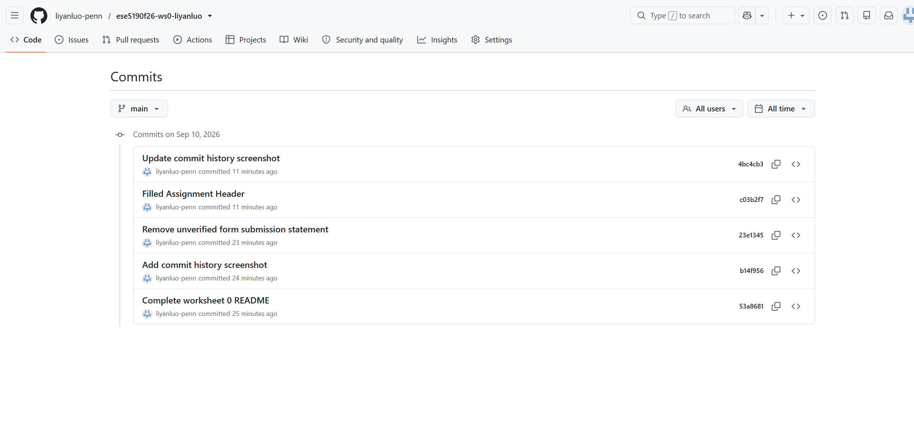

# ESE 5190 Worksheet 0

Name: Liyan Luo  
GitHub: `liyanluo-penn`  
Repo: [ese5190f26-ws0-liyanluo](https://github.com/liyanluo-penn/ese5190f26-ws0-liyanluo)  
Hardware: Windows laptop, ATmega328PB Xplained Mini development board, and course electronics components.

---

## (R1)

GitHub handle: `liyanluo-penn`

## (S1)

Commit history screenshot:

---

## (R2)

For the CMB-6544PF electret microphone:

- Operating temperature: **-40°C to +70°C**
- Frequency range: **20 Hz to 20 kHz**
- Current consumption: **0.5 mA max**

The current consumption is specified with \(V_S = 4.5V\) and \(R_L = 1k\Omega\).

---

## (R3)

For the RMCF0603FT2K20 resistor:

- Power rating at 70°C: **0.1 W**
- Max working voltage: **75 V**

---

## (R4)

The absolute maximum DC current for one ATmega328PB I/O pin is **40 mA**.

With a 5 V output:

\[
R = \frac{V}{I} = \frac{5}{0.04} = 125\Omega
\]

So **125 Ω is the resistance at the 40 mA limit**. Any resistor smaller than 125 Ω would exceed the absolute maximum current under the ideal 5 V assumption.

For example, with 120 Ω:

\[
I = \frac{5}{120} = 0.0417A = 41.7mA
\]

which is above the limit.

The maximum I/O leakage current is **1 µA**.

Leakage current is the small amount of unwanted current that can still flow through a semiconductor input even when the pin is supposed to be high impedance.

---

## (R5)

For the blue LED:

- Supply voltage: **5 V**
- Forward voltage: **3.2–3.8 V**
- Maximum forward current: **30 mA**

The worst case is the minimum forward voltage, 3.2 V, because that leaves the most voltage across the resistor.

\[
R = \frac{5-3.2}{0.03} = 60\Omega
\]

So the minimum calculated resistance is **60 Ω**.

A standard value such as **62 Ω or larger** would keep the current at or below the limit.

---

## (R6)

### 22 kΩ through-hole resistor

Part: **KOA Speer CF1/2CT52R223J**

- 22 kΩ
- ±5%
- 0.5 W
- Through-hole
- Active / in stock

[DigiKey product listing](https://www.digikey.com/en/products/detail/koa-speer-electronics-inc/CF1-2CT52R223J/21681480)

### Through-hole pushbutton

Part: **E-Switch TL2201OAYA**

- Through-hole
- Momentary pushbutton
- 100 mA at 30 VDC
- Active / in stock

[DigiKey product listing](https://www.digikey.com/en/products/detail/e-switch/TL2201OAYA/583531)

---

## (R7)

**1. What types of questions will be seen in worksheets/labs in the README submission?**

The course uses:

- R: README questions
- I: Images
- S: Screenshots
- C: Code submissions
- V: Video submissions
- T: TA check-offs

**2. What document type is submitted to Gradescope?**

A **PDF version of the README.md** is submitted to Gradescope. The text and images should be visible and the links should be clickable.

**3. Which assignments can late days be used on?**

Late days can only be used on **worksheets**. We have **4 total late days**. They cannot be used on labs, quizzes, or final project assignments.
